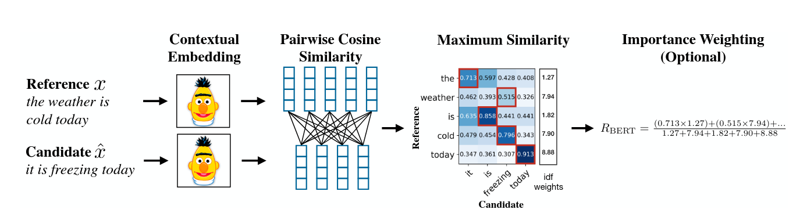
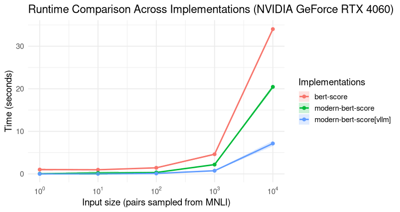

# BERTScore for the Inference Era



**Modern-BERT-Score** is a reimplementation of the BERTScore metric introduced by [Zhang et al., 2019](https://arxiv.org/abs/1904.09675), optimized for modern inference workflows using [SentenceTransformers](https://www.sbert.net/) and [vLLM](https://vllm.ai/).  

This library provides fast, GPU-accelerated scoring for text generation evaluation, making BERTScore practical for large-scale inference tasks.

---

## ⚡ Features
- Fast, efficient computation with optional vLLM support  
- Compatible with all Hugging Face transformer models  
- Supports truncated and optimized model versions for faster inference  
- Works seamlessly with both CPU and GPU setups  

---

## 📦 Installation

Modern-BERT-Score comes in **two variants**: a base version and a vLLM-enhanced version. For vLLM, an NVIDIA GPU is strongly recommended.  

### Base Version
```bash
pip install modern-bert-score
```

### vLLM Version
```{bash}
pip install modern-bert-score[vllm]
```
This implementation is significantly faster than the original BERTScore, especially with GPU acceleration.



## 🛠 Usage
### Example
```python
from modern_bert_score import BertScore

candidates = ["Hello World!", "A robin is a bird."]
references = ["Hi World!", "A robin is not a bird."]

metric = BertScore(model_id="roberta-base")
scores = metric(candidates, references)

# scores is a list of (Precision, Recall, F1) tuples
# To get separate lists of P, R, F1:
P, R, F1 = zip(*scores)

print("Precision scores:", P)
print("Recall scores:", R)
print("F1 scores:", F1)
```

## ⚠️ NOTICE

- For best performance, an optimal layer should be used for each model.  
- To find the optimal layer, [please use this script from the original BERTScore implementation](https://github.com/Tiiiger/bert_score/tree/master/tune_layers).  

Some pre-truncated models optimized for vLLM are available on [Hugging Face](https://huggingface.co/collections/LazerLambda/modern-bertscore):

- `LazerLambda/ModernBERT-base-ModBERTScore-12`  
- `LazerLambda/ModernBERT-large-ModBERTScore-19`  
- `LazerLambda/roberta-large-ModBERTScore-17`  
- `LazerLambda/roberta-base-ModBERTScore-10`  
- `LazerLambda/roberta-large-mnli-ModBERTScore-19`


## 🗺 Roadmap

- [x] Implement base version and vLLM addon  
- [x] Add IDF-weighted scoring  
- [ ] Add baseline-rescaling and scripts for identifying optimal baselines  
- [ ] Add model (vLLM-)adaptation script for slicing the model